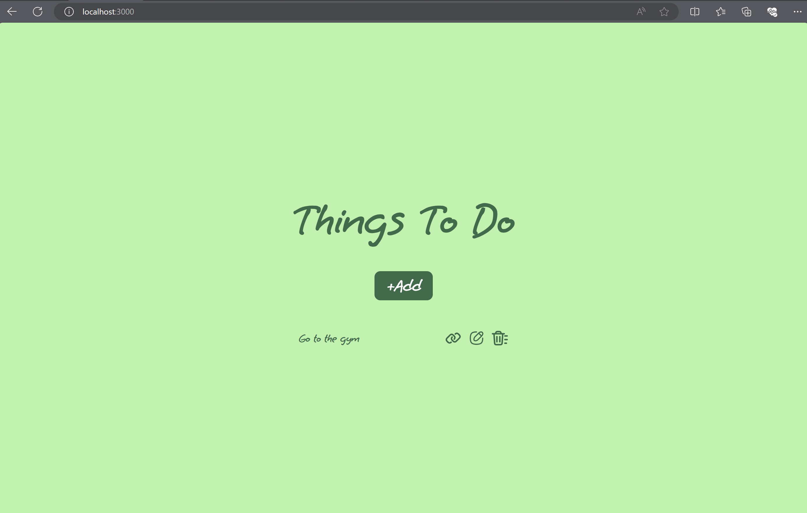
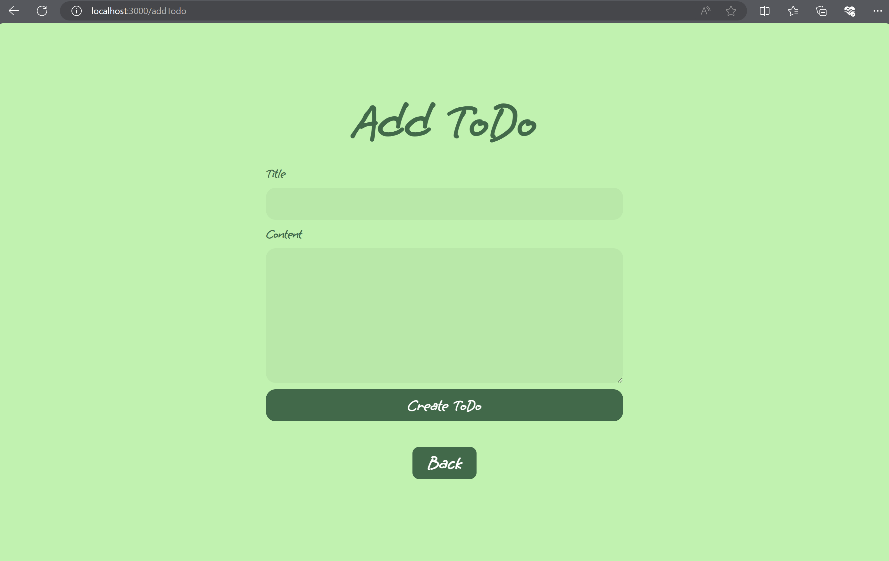
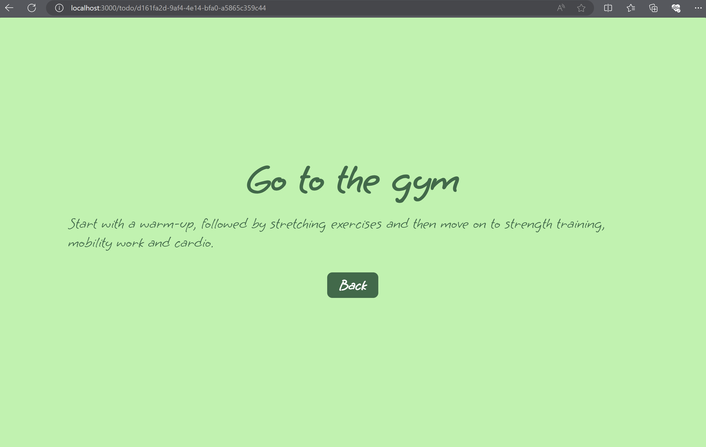
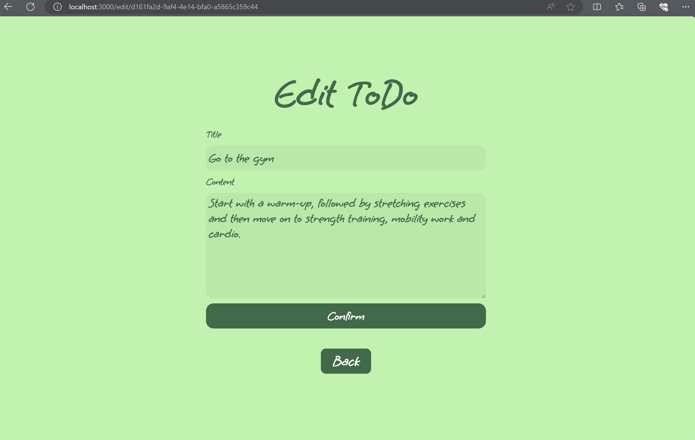

# to-do

A functional to-do app running without a database. Featuring NodeJS runtime, its a creative milestone for my web design career.

# usage

Step 1 clone the repository

`git clone https://github.com/j-githaka/to-do.git`

Step 2 go to the to-do app directory

`cd to-do`

Step 3 install all necessary dependencies

`npm i`

step 4 run the app

`node index.js`

or if you have nodemon configured

`nodemon index.js` 

# pages

## todo page 



## add todo page



## view todo page



## edit todo page



# more info

The app comes with a default todo entry you can always customize on the index.js file.

```javascript

let todos = [

	{
		id : todoID () , 

		name : "Go to the gym" ,

		about : "Start with a warm-up, followed by stretching exercises and then move on to strength training, mobility work and cardio."

	} ,

] ;

```

# note

The project does not have a database and works with the list described above. Any entry on the client side is automatically added, deleted or updated using list methods. You can have a look on the index.js file to understand how I did it. However, the routes used in the delete and update section utilize the `GET` method. For example ;  

```javascript

app .get (

	"/delete/:id" ,

	( req , res ) => {

		let targetTodo = req .params .id ;

		let targetId = 0 ;

		todos .forEach (

			( todo ) => {

				if ( todo .id == targetTodo ) {

					targetId = todos .indexOf ( todo ) ;

				} 

			}

		) ;

		todos .splice ( targetId , 1 ) ;

		res .redirect ( "/" ) ;

	}

) ;

```


